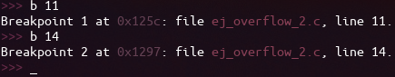
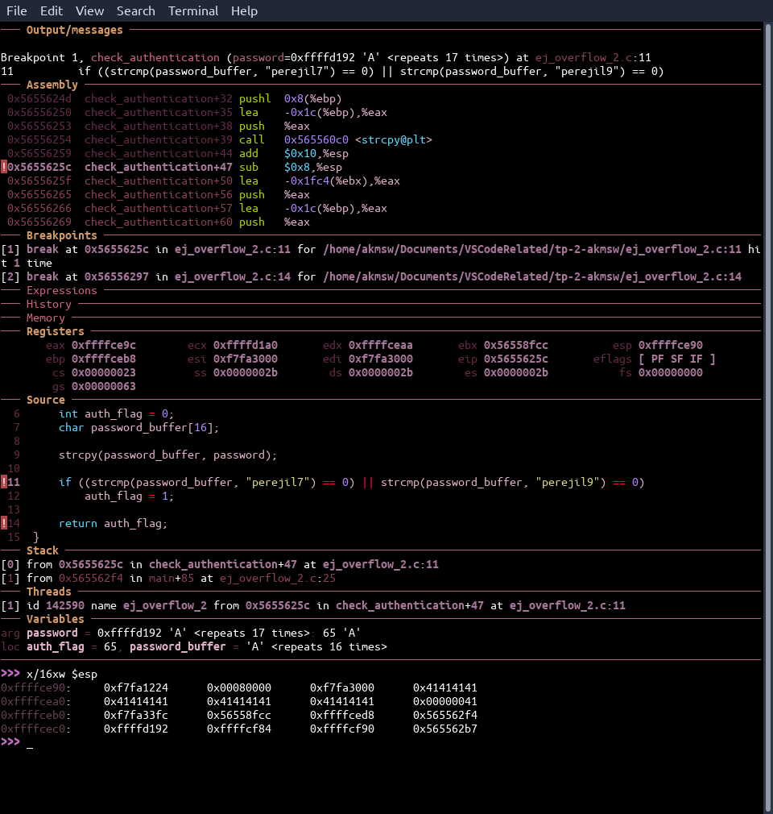
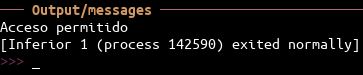

# Buffer overflow

## Brief
El siguiente es un trabajo práctico que consta de explorar las posibilidades de exploits en un programa escrito en C, aplicando la técnica de buffer overflow.

## Details
### Compilation & tools
- Para la compilación, se utilizaron las flags `-m32` para indicar que el proyecto debe ser compilado para una arquitectura de 32 bits, y `-fno-stack-protector` para indicar que se debe desactivar la protección del stack.
    - Es importante desactivar la protección del stack ya que en arquitecturas de 64 bits, la dirección de retorno es protegida con dos palabras que no pueden escribirse. Como estas palabras son de sólo lectura, si intentamos pisarlas para poder llegar a la dirección de retorno y modificarla, se producirá una excepción que detendrá automáticamente la ejecución del programa. En una arquitectura de 32 bits se puede desactivar la protección de stack para poder lograr nuestro objetivo.
- Se utilizó [dashboard](https://github.com/cyrus-and/gdb-dashboard), un plugin para el debugger [gdb](https://cs.baylor.edu/~donahoo/tools/gdb/tutorial.html).

### The program
El programa sobre el cual se hará la demostración del buffer overflow es un simple autenticador de contraseñas. Si el usuario ingresa una contraseña que no sea `perejil7` ó `perejil9`, se mostrará en pantalla un mensaje de acceso denegado. Caso contrario, se mostrará un mensaje de acceso permitido. Esto se chequea mediante una función que toma el primer argumento del programa (`argv[1]`), se lo copia a un buffer y se lo compara con los strings de las contraseñas permitidas, y el resultado de la comparación indica si se debe retornar el flag de autenticación en 0 (contraseña correcta) ó 1 (contraseña incorrecta).

### Running
Para comenzar, se colocaron los breakpoints en aquellos puntos de interés del programa. Nos queremos enfocar en el stack luego de copiar el input del usuario al arreglo `password_buffer` y en el momento en el que se retorna el valor de `auth_flag`, para verificar su valor. Estos puntos de interés corresponden a las líneas 11 y 14 respectivamente, por lo que colocamos breakpoints allí de la forma:\
\
Como se puede ver, el buffer declarado tiene espacio para 16 caracteres, por lo que si queremos sobrepasar ese límite tendremos que ingresar al menos 17 caracteres.\
Recordando la estructura del stack, recordamos que por encima del registro `ebp` se hallan las variables locales de las funciones, las cuales se apilan en el orden en el que se declaran (la última declarada es queda en la parte superior del stack). En este caso, la función `check_authentication` posee dos variables locales, y primero se declara `auth_flag` y luego `password_buffer`, por lo que tendremos 16 bytes (4 palabras de 32 bits) en la parte superior de la pila representando al buffer, y los 4 bytes siguientes (la siguiente palabra de 32 bits) estará representando a la flag de tipo `int`.
Como prueba de ello, corremos el programa con 17 letras A, cuyo valor ASCII es 65 y convertido a hexadecimal es 0x41, deteniéndonos en el breakpoint correspondiente al estado del programa luego de haber copiado el input al buffer:\
\
Como se puede ver, en el stack están los 16 bytes (4 palabras de 32 bits) con el valor hexadecimal 0x41, representando las 16 letras del buffer. Como se ingresó una 17ma letra 'A', la palabra siguiente contiene la representación en 32 bits de la letra 'A': 0x00000041. Además, para terminar de confirmar que estamos pisando el valor de la variable `auth_flag`, podemos ver que en la sección ***Variables*** tenemos como argumento la letra 'A' repetida 17 veces (65 en decimal, 0x41 en hexadecimal), y las variables locales tienen los siguientes valores:
- `password_buffer`: 'A' repetida 16 veces.
- `auth_flag`: 65 (correspondiente al valor hexadecimal de la letra 'A' en ASCII).

Si ahora continuamos la ejecución del programa hasta el retorno a la función main, veremos el output:\
\
De esta manera, hemos logrado hacer un buffer overflow para escribir el valor de una variable local de interés para obtener un acceso permitido.

## Bibliography
Para el desarrollo de este trabajo práctico fue consultada la siguiente bibliografía:
- ["Guía de escritura de exploits" - Fundación Sadosky](https://fundacion-sadosky.github.io/guia-escritura-exploits/buffer-overflow/1-introduccion.html).
- Artículo ["Smashing the stack for fun and profit"](http://phrack.org/issues/49/14.html#article), de Aleph One.
- Libro "Hacking: The art of exploitation", segunda edición, de Jon Erickson.
- Exposiciones de clase sobre las aplicaciones de convenciones de llamada.
